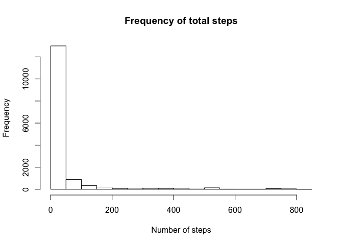
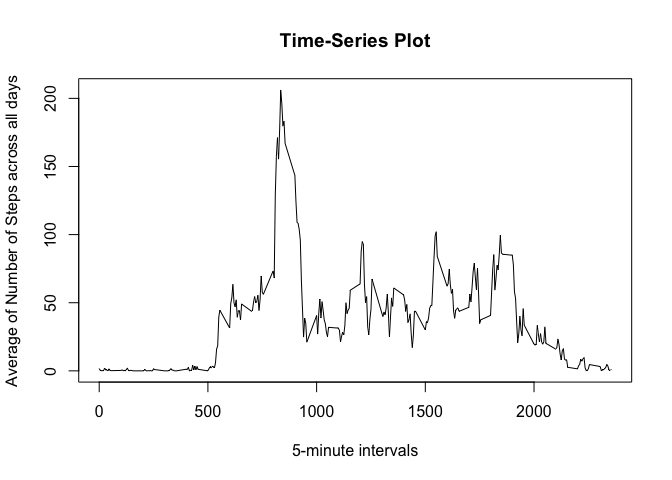
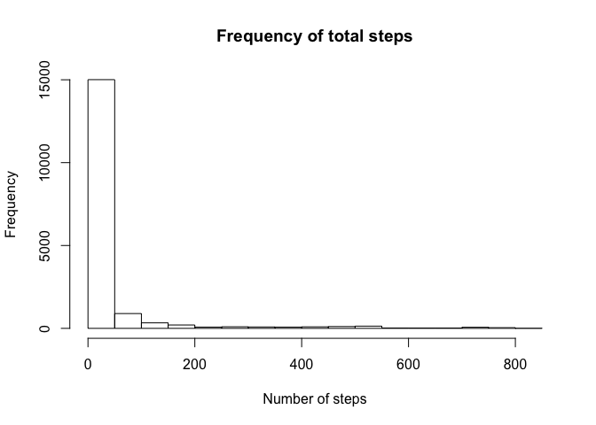
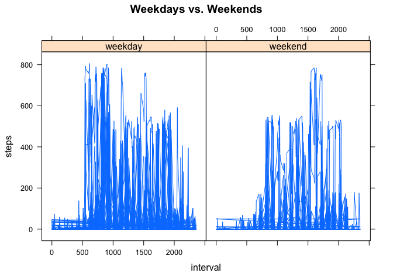

# Assessment Activity 1
## Reading the files

To start things with, first we have to unzip and read the file into the environment:


```r
unzip("activity.zip")
x <- read.csv("activity.csv", stringsAsFactors = FALSE)
```

## Histogram of steps per day

We show the total number of steps taken for all days:


```r
hist(x$steps, xlab = "Number of steps", main = "Frequency of total steps")
```

<!-- -->

## Base Statistics of the dataset
Now we show the calculations of the mean and median of steps per day. We use **y** as a complete.cases (without NA) version of **x**, our original dataset:


```r
y <- na.omit(x)
means <- tapply(y$steps, y$date, mean)
medians <- tapply(y$steps, y$date, median)
```


## Time Series interval
Now we turn to plot our time-series interval, we need to first obtain the unique of the sequence of 5-minute intervals (ranging from zero to 2355) and obtain as well the average across all days.

We do as well find out that the maximum of this vector is located at the position 104, namely, at the 835 minute time mark:


```r
average_days <- tapply(y$steps, y$interval, mean)
plot(unique(y$interval), average_days, type = "l", xlab = "5-minute intervals", ylab = "Average of Number of Steps across all days", main = "Time-Series Plot")
```

<!-- -->

```r
which.max(average_days)
```

```
## 835 
## 104
```

```r
average_days[104]
```

```
##      835 
## 206.1698
```

## Imputing Data
We calculate the number of **NA** located in the steps sub-vector of the dataset, then we proceed to replace the values with those of the *means* per date (mean of the steps of that day).


```r
pos_mean <- match(x$date, unique(x$date))
sum(is.na(x$steps))
```

```
## [1] 2304
```

```r
z <- x
z$steps[is.na(z$steps)] <- means[pos_mean[is.na(z$steps)]]
```


```r
hist(z$steps, xlab = "Number of steps", main = "Frequency of total steps")
```

<!-- -->


```r
means2 <- tapply(z$steps, z$date, mean)
medians2 <- tapply(z$steps, z$date, median)
```

It seems the values vary when imputed, which has an effect on the analysis of the data.

## Comparing Weekdays vs. Weekends

Now we load the **lattice** library which allows us to compare easily different factors.

First we create a new column in our dataframe, newFactor, which will contain "weekday" or "weekend" as factors.


```r
library(lattice)
daysofweek <- c("Monday", "Tuesday", "Wednesday", "Thursday", "Friday")
z$newFactor <- c("weekend", "weekday")[(weekdays(as.Date(z$date)) %in% daysofweek)+1L]
xyplot(steps ~ interval | newFactor, z, type = "l", pch = 20, main = "Weekdays vs. Weekends")
```

<!-- -->
